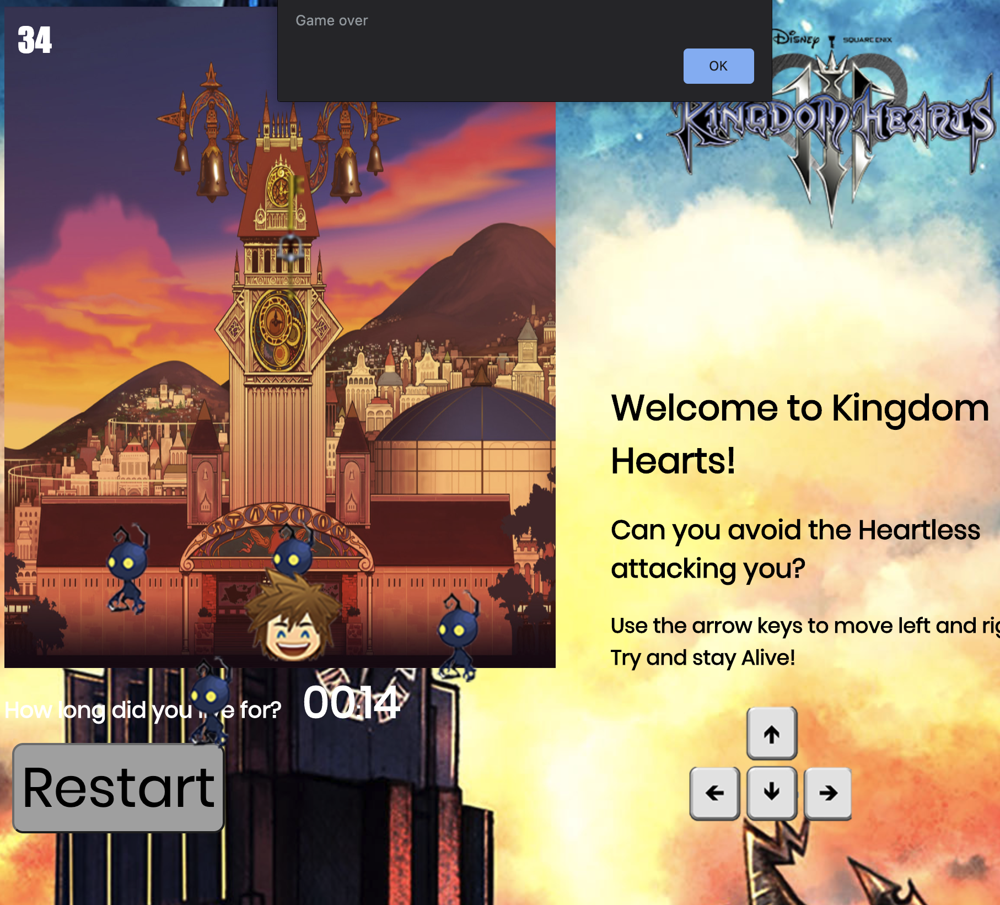

# Object Oriented Programming Game Project

# Introduction

Changed the readMe so that it could include the information I wrote on my project!

I had done it on a favourite game of mine, Kingdom Hearts.

# Things I had got working
Updated the final version of my project to Github.
Features I had put in myself:
Game ending alert when a collision happens.
1 point per enemy avoided.
Score displayed in the top corner.
Maximum amount of enemies increased.
Increased game size.
Added background music that works with restart.
Restart button added that creates an alert.
Text to provide details of the game.
Timer to show how long you're alive for.

# Things I had started but could not finish

Added a shooting mechanic with a picture from the game but could not get the collision to work.
Used photoshop to create other sprites as bonus characters (created sprites.js) but could not figure out how to get them into the game.

Proud of what I have put together though!
